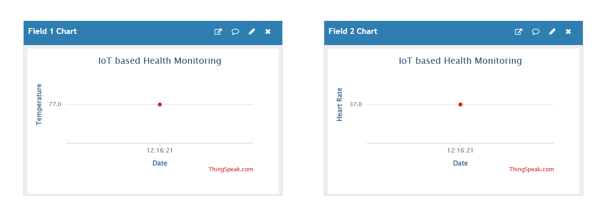

# IoT based-Health Monitoring System (ThingSpeak + Python)

## 📌 Project Description

This project is a simulation-based IoT health monitoring system developed using Python and ThingSpeak. It monitors health-related data and sends it to the cloud platform for visualization.

## 🛠️ Technologies Used

* Python
* ThingSpeak (IoT Cloud Platform)
* requests (Python library)

## ⚙️ Working

The system uses the Python requests library to send data to ThingSpeak using HTTP API. The data is stored in the cloud and displayed as real-time graphs.

## 📊 Output

The output is visualized in ThingSpeak as graphs showing health data.
## 📸 Output Screenshot

## 🚀 Applications

* Remote patient monitoring
* Health data tracking
* IoT-based healthcare systems

## 🔮 Future Scope

This project can be extended by integrating real sensors like heart rate and temperature sensors for real-time monitoring.

## ▶️ How to Run

1. Install Python
2. Install required library:
   pip install requests
3. Run the Python file:
   python IoT Monitoring.py

## 📌 Conclusion

This project demonstrates how IoT and cloud platforms can be used for health monitoring applications.
